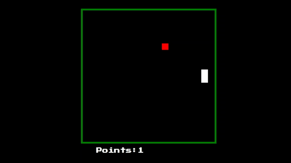

# Snake in Javascript
## Date Started: 8/9/21
### By: Ryan Craig

[LinkedIn](https://www.linkedin.com/in/ryancraigeit/)

***

***

### *Description*

I will be building Snake utilizing HTML/CSS/JavaScript. This project will be be featured on my professional portfolio.

***

### *Game Instructions*

* The game begins with a snake that is one unit in length (white) and a piece of food randomly placed on the board (red).
* You control the movement of the snake using arrow keys on your keyboard. The snake cannot reverse its direction!
* The goal of the game is to eat the apples with your snake. Every time you eat an apple the snake will grow by 1 unit.
* Try to eat as many apples as possible without going off of the gameboard or hitting your own body.

***

***Future Updates***

- [ ] A game restart without refreshing the page.
- [ ] More responsive webpage
- [ ] Difficulty Settings

<!-- *** -->

<!-- **Credits**: -->
